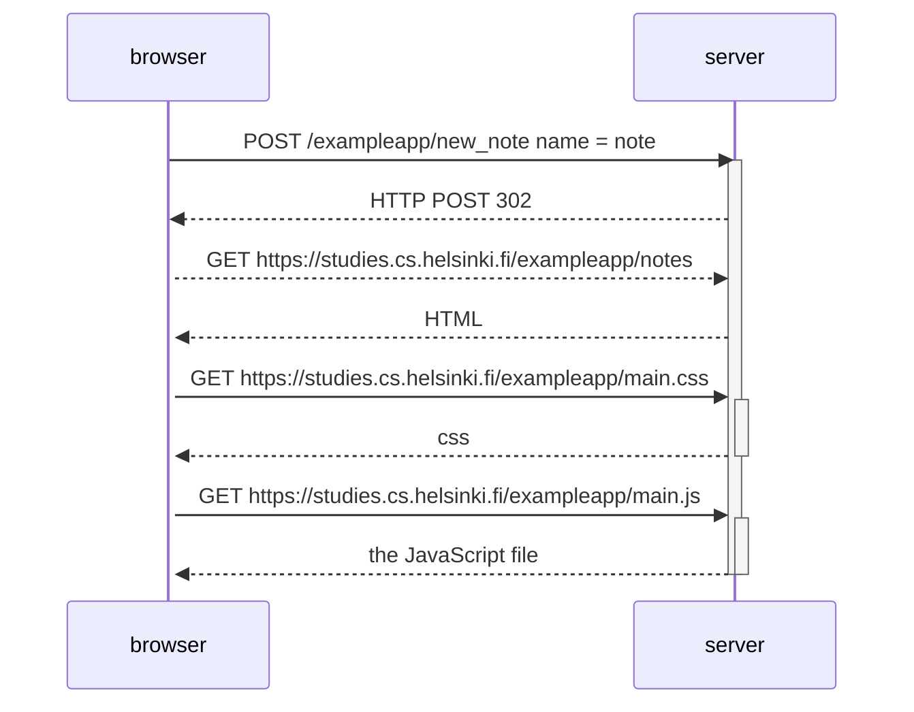

```mermaid 
sequenceDiagram
    participant browser
    participant server
    browser->>server: POST /exampleapp/new_note name = note
    activate server
    server-->>browser: HTTP POST 302
    
    activate browser
    browser-->>server: GET https://studies.cs.helsinki.fi/exampleapp/notes
    server-->>browser: HTML
    browser->>server: GET https://studies.cs.helsinki.fi/exampleapp/main.css
    activate server
    server-->>browser: css
    deactivate server
    browser->>server: GET https://studies.cs.helsinki.fi/exampleapp/main.js
    activate server
    server-->>browser: the JavaScript file
    deactivate server
    deactivate server
```